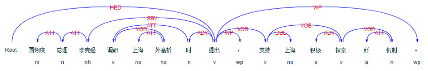
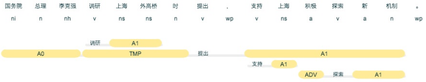
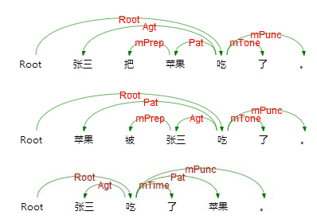
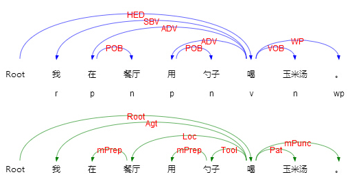

# pyltp的基本使用


```python
# -*- coding: utf-8 -*-
from pyltp import SentenceSplitter
from pyltp import Segmentor
from pyltp import Postagger
from pyltp import NamedEntityRecognizer
from pyltp import Parser
from pyltp import SementicRoleLabeller
```

## 功能1：分句


```python
sents = SentenceSplitter.split('元芳你怎么看？我就趴窗口上看呗！')  # 分句
print '\n'.join(sents)
```

    元芳你怎么看？
    我就趴窗口上看呗！


## 功能2：分词


```python
segmentor = Segmentor()  # 初始化实例
segmentor.load('./ltp_data/cws.model')  # 加载模型
words = segmentor.segment('我在北京故宫里看花。')  # 分词
word2 = segmentor.segment('我们同学间有结婚的和尚结婚的人，不过这不影响我们间的感情。')  # 分词
print ' '.join(words)
print ' '.join(word2)
word2 = list(word2)
print ' '.join(word2)
# print type(word2)
segmentor.release()  # 释放模型
```

    我 在 北京 故宫 里看花 。
    我们 同学 间 有 结婚 的 和尚 结婚 的 人 ， 不过 这 不 影响 我们 间 的 感情 。
    我们 同学 间 有 结婚 的 和尚 结婚 的 人 ， 不过 这 不 影响 我们 间 的 感情 。


- LTP还有加入自定义词典以及个性化特定领域的训练方法等，这里就不再介绍了。words = segmentor.segment() 的返回值类型是native的VectorOfString类型，可以使用list转换成Python的列表类型

## 功能3：词性标注


```python
postagger = Postagger() # 初始化实例
postagger.load('./ltp_data/pos.model')  # 加载模型
postags = postagger.postag(words)  # 词性标注
print ' '.join(postags)
postagger.release()  # 释放模型
```

    r p ns ns n wp


- 参数 words 是分词模块的返回值，也支持Python原生的列表类型，例如

> words = ['元芳', '你', '怎么', '看']

> postags = postagger.postag(words)

LTP 使用 863 词性标注集，详细请参考 词性标注集 。

## 功能4：命名实体识别


```python
recognizer = NamedEntityRecognizer() # 初始化实例
recognizer.load('./ltp_data/ner.model')  # 加载模型
netags = recognizer.recognize(words, postags)  # 命名实体识别
print ' '.join(netags)
recognizer.release()  # 释放模型
```

    O O B-Ns I-Ns E-Ns O


- 其中，words 和 postags 分别为分词和词性标注的结果。LTP 提供的命名实体类型为:**人名**、**地名**、**机构名**，详细请参考 命名实体识别标注集 。

## 功能5：依存句法分析


```python
parser = Parser() # 初始化实例
parser.load('./ltp_data/parser.model')  # 加载模型
arcs = parser.parse(words, postags)  # 句法分析
print " ".join("%d:%s" % (arc.head, arc.relation) for arc in arcs)
parser.release()  # 释放模型
```

    5:SBV 5:ADV 4:ATT 2:POB 0:HED 5:WP


- 其中，words 和 postags 分别为分词和词性标注的结果。arc.head 表示依存弧的父节点词的索引，arc.relation 表示依存弧的关系。



## 功能 6：语角角色标注


```python
labeller = SementicRoleLabeller() # 初始化实例
labeller.load('./ltp_data/srl')  # 加载模型
roles = labeller.label(words, postags, netags, arcs)  # 语义角色标注
for role in roles:
    print role.index, "".join(
        ["%s:(%d,%d)" % (arg.name, arg.range.start, arg.range.end) for arg in role.arguments])
labeller.release()  # 释放模型
```

    4 A0:(0,0)LOC:(1,3)



- 其中有三个谓词提出，调研和探索。以探索为例，积极是它的方式（一般用ADV表示），而新机制则是它的受事（一般用A1表示）

- 核心的语义角色为 A0-5 六种，A0 通常表示动作的施事，A1通常表示动作的影响等，A2-5 根据谓语动词不同会有不同的语义含义。其余的15个语义角色为附加语义角色，如LOC 表示地点，TMP 表示时间等。附加语义角色见[语言云](http://www.ltp-cloud.com/intro/#srl_how)

## 语义依存分析
语义依存分析 (Semantic Dependency Parsing, SDP)，分析句子各个语言单位之间的语义关联，并将语义关联以依存结构呈现。 使用语义依存刻画句子语义，好处在于不需要去抽象词汇本身，而是通过词汇所承受的语义框架来描述该词汇，而论元的数目相对词汇来说数量总是少了很多的。语义依存分析目标是跨越句子表层句法结构的束缚，直接获取深层的语义信息。 例如以下三个句子，用不同的表达方式表达了同一个语义信息，即张三实施了一个吃的动作，吃的动作是对苹果实施的。

语义依存分析不受句法结构的影响，将具有直接语义关联的语言单元直接连接依存弧并标记上相应的语义关系。这也是语义依存分析与句法依存分析的重要区别。

如上例对比了句法依存和语义分析的结果，可以看到两者存在两个显著差别。第一，句法依存某种程度上更重视非实词（如介词）在句子结构分析中的作用，而语义依存更倾向在具有直接语义关联的实词之间建立直接依存弧，非实词作为辅助标记存在。 第二，两者依存弧上标记的语义关系完全不同，语义依存关系是由论元关系引申归纳而来，可以用于回答问题，如我在哪里喝汤，我在用什么喝汤，谁在喝汤，我在喝什么。但是句法依存却没有这个能力。

语义依存与语义角色标注之间也存在关联，语义角色标注只关注句子主要谓词的论元及谓词与论元之间的关系，而语义依存不仅关注谓词与论元的关系，还关注谓词与谓词之间、论元与论元之间、论元内部的语义关系。语义依存对句子语义信息的刻画更加完整全面。

语义依存关系分为三类，分别是主要语义角色，每一种语义角色对应存在一个嵌套关系和反关系；事件关系，描述两个事件间的关系；语义依附标记，标记说话者语气等依附性信息。
